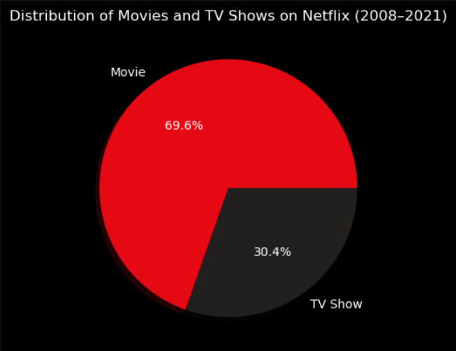
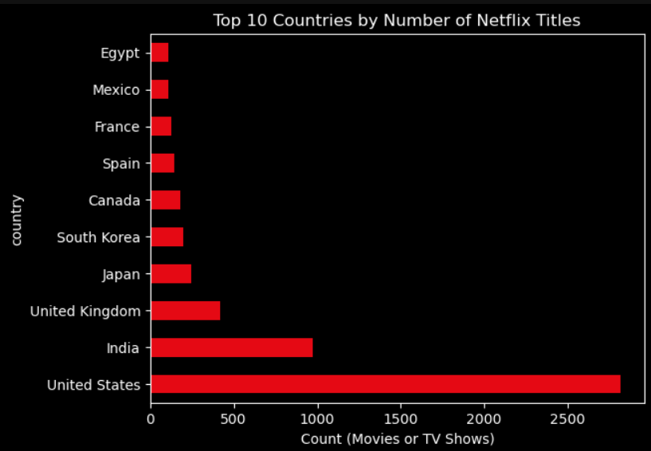
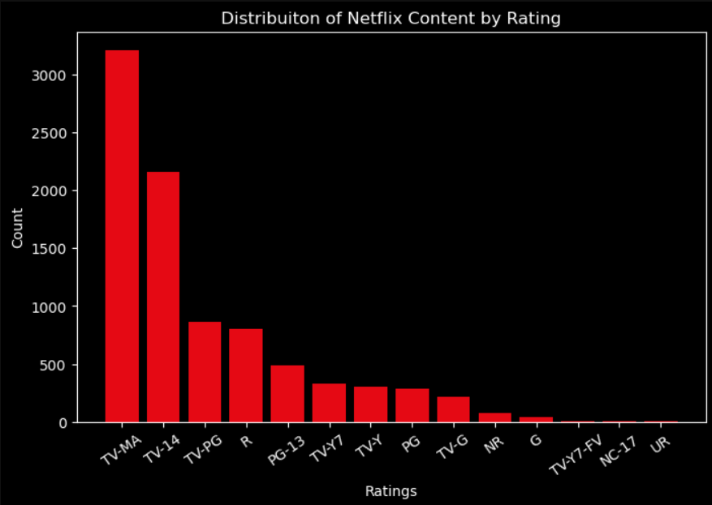
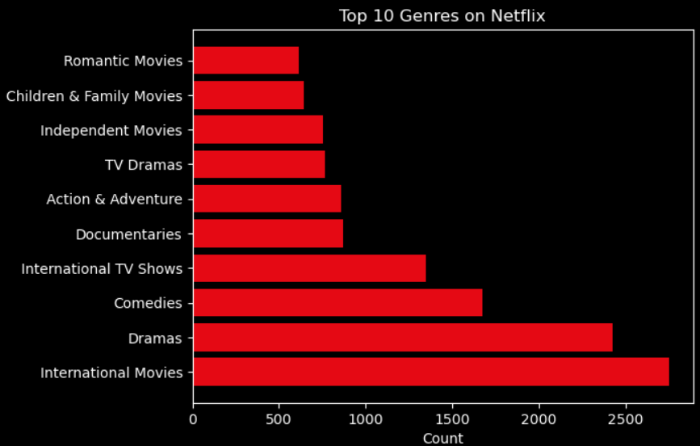
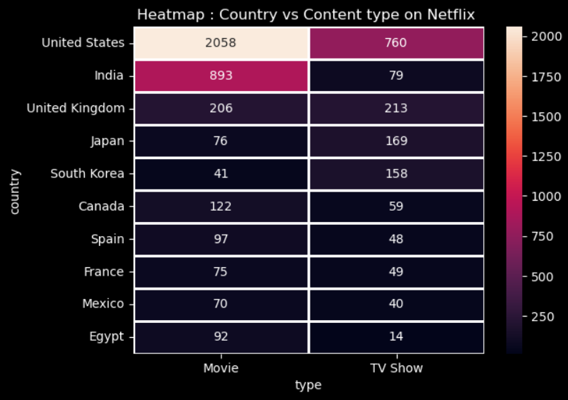

# Netflix Exploratory Data Analysis (EDA) 

## Project Overview.
 
This project performs Exploratory Data Analysis (EDA) on the Netflix Movies and TV Shows dataset to uncover insights about Netflix's content library. The analysis focuses on understanding content distribution, trends over time, genres, ratings, countries, and directors through data cleaning, visualization, and interpretation.

## Objectives.
- Analyze the distribution of Movies and TV Shows.
- Explore how Netflix's content library has grown over time.
- Identify the top content-producing countries.
- Examine the most common content ratings.
- Discover the most popular genres.
- Analyze directors with the highest number of titles.
- Generate meaningful business insights using data visualization.

## Dataset
- Dataset : Netflix Movies and TV Shows.
- Source : Kaggle.
- File Used : netflix_titles.csv

## Technologies Used
- Python
- Pandas
- NumPy
- Matplotlib
- Seaborn
- Jupyter Notebook

## Skills Demonstrated

- Data Cleaning
- Exploratory Data Analysis (EDA)
- Data Visualization
- Handling Missing Values
- Feature Engineering
- Statistical Summary
- Insight Generation
- Python Programming
- Pandas
- NumPy
- Matplotlib
- Seaborn

## Analysis Performed
The notebook includes:  
- Data Loading
- Data Exploration
- Data Cleaning
- Handling Missing Values
- Datetime Conversion
- Movies vs TV Shows Analysis
- Content Added Over Time
- Country-wise Analysis
- Rating Distribution
- Genre Distribution
- Director Analysis
- Correlation Heatmap
- Final Conclusions

# Key Insights

- Movies make up a larger share of Netflix's catalog than TV Shows.
- The United States contributes the highest number of titles.
- Netflix experienced significant content growth after 2015.
- TV-MA is the most frequently assigned maturity rating.
- International Movies are among the most common genres.
- A small number of directors contribute multiple titles, while most directors appear only once.

## Visualizations

## Movies VS TV Shows

## Top Countries

## Rating Distribution

## Top Genres

## Heatmap of Country-wise Distribution of Movies and TV Shows on Netflix

## Future Improvements
- Interactive dashboard using Plotly or Power BI
- Sentiment analysis using movie descriptions
- Recommendation system.
- Machine learning-based content prediction

## Author
**Avidny Mestry** 
- GitHub : https://github.com/Avidny27
